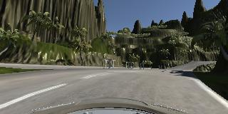
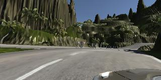
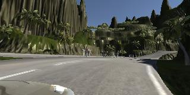
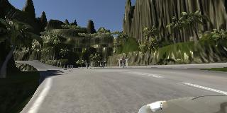
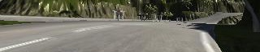
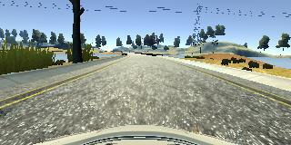

# **Behavioral Cloning** 

## Designed by Herbertkid

### Introduction

In this project, I will use what learned about deep neural networks and convolutional neural networks to clone driving behavior. I will train, validate and test a model using Keras. The model will output a steering angle to an autonomous vehicle.

---

**Behavioral Cloning Project**

The goals / steps of this project are the following:
* Use the simulator to collect data of good driving behavior
* Build, a convolution neural network in Keras that predicts steering angles from images
* Train and validate the model with a training and validation set
* Test that the model successfully drives around track one without leaving the road
* Summarize the results with a written report


---

My project includes the following files:
* model.py containing the script to create and train the model
* drive.py for driving the car in autonomous mode
* model.h5 containing a trained convolution neural network 
* writeup_report.md summarizing the results
* run1.mp4 the recording of autonomous vehicle on track one


Using the Udacity provided simulator and my drive.py file, the car can be driven autonomously around the track by executing 
```sh
python drive.py model.h5
```

The model.py file contains the code for training and saving the convolution neural network. The file shows the pipeline I used for training and validating the model, and it contains comments to explain how the code works.

### Model Architecture and Training Strategy

#### Model Architecture

I used the well-known NVIDIA CNN. Figure 5 shows the network architecture, which consists of 9 layers, including a normalization layer, 5 convolutional layers, and 3 fully connected layers. The input image is split into YUV planes and passed to the network.

In my architecture that added 3 dropout layers and one fully connected layer, so that the final output is 1.

[NVIDIA CNN](https://devblogs.nvidia.com/deep-learning-self-driving-cars/)


My architecture code:

model.add(Lambda(lambda x: x/255.0 - 0.5, input_shape=(160,320,3)))
model.add(Cropping2D(cropping=((70,25),(0,0))))
model.add(Conv2D(24,5,5,subsample=(2,2),activation="relu"))
model.add(Conv2D(36,5,5,subsample=(2,2),activation="relu"))
model.add(Conv2D(48,5,5,subsample=(2,2),activation="relu"))
model.add(Conv2D(64,3,3,activation="relu"))
model.add(Conv2D(64,3,3,activation="relu"))
model.add(Flatten())
model.add(Dropout(0.5))
model.add(Dense(100))
model.add(Dropout(0.5))
model.add(Dense(50))
model.add(Dropout(0.5))
model.add(Dense(10))
model.add(Dense(1))
 

#### 2. Attempts to reduce overfitting in the model

The model contains dropout layers in order to reduce overfitting (line75 in model.py). 

The model was trained and validated on different data sets to ensure that the model was not overfitting (split to train data and validate data). 
The model was tested by running it through the simulator and ensuring that the vehicle could stay on the track.

#### 3. Model parameter tuning

The model used an adam optimizer, so the learning rate was not tuned manually (model.py line 83).

#### 4. Appropriate training data

Training data was chosen to keep the vehicle driving on the road. I used a combination of center lane driving, recovering from the left and right sides of the road.
Also I collected the data on the convertrack, and used flip function to get more training data.
What's more, I collected track 2 data and one lap of recovery driving from the sides.

center ,left, and right images:







flipped image:



cropped image:



### Model Architecture and Training Strategy

#### 1. Solution Design Approach

The overall strategy for deriving a model architecture was to CNN

My first step was to use a convolution neural network model similar to the NVIDIA CNN Architecture I thought this model might be appropriate because it is good for self-driving works.

In order to gauge how well the model was working, I split my image and steering angle data into a training and validation set. I found that my first model had a low mean squared error on the training set but a high mean squared error on the validation set. This implied that the model was overfitting. 

To combat the overfitting, I modified the model so that added some dropout layers between fully connected layers.

The final step was to run the simulator to see how well the car was driving around track one. There were a few spots where the vehicle fell off the track 2 to improve the driving behavior in these cases, 

to turn the car around and record counter-clockwise laps around the track. Driving counter-clockwise is also like giving the model a new track to learn from, so the model will generalize better.

At the end of the process, the vehicle is able to drive autonomously around the track without leaving the road.

#### 2. Final Model Architecture

The final model architecture (model.py lines 67-81) consisted of a convolution neural network with the following layers and layer sizes 

Here is a visualization of the architecture (note: visualizing the architecture is optional according to the project rubric)

_________________________________________________________________
|Layer (type)             |    Output Shape          |    Param #|   
|-------------------------|--------------------------|-----------|
|lambda_1 (Lambda)        |    (None, 160, 320, 3)   |    0      |   
|cropping2d_1 (Cropping2D)|    (None, 65, 320, 3)    |    0      |   
|conv2d_1 (Conv2D)        |    (None, 31, 158, 24)   |    1824   |   
|conv2d_2 (Conv2D)        |    (None, 14, 77, 36)    |    21636  |   
|conv2d_3 (Conv2D)        |    (None, 5, 37, 48)     |    43248  |   
|conv2d_4 (Conv2D)        |    (None, 3, 35, 64)     |    27712  |   
|conv2d_5 (Conv2D)        |    (None, 1, 33, 64)     |    36928  |   
|flatten_1 (Flatten)      |    (None, 2112)          |    0      |   
|dropout_1 (Dropout)      |    (None, 2112)          |    0      |   
|dense_1 (Dense)          |    (None, 100)           |    211300 |   
|dropout_2 (Dropout)      |    (None, 100)           |    0      |   
|dense_2 (Dense)          |    (None, 50)            |    5050   |   
|dropout_3 (Dropout)      |    (None, 50)            |    0      |   
|dense_3 (Dense)          |    (None, 10)            |    510    |   
|dense_4 (Dense)          |    (None, 1)             |    11     |   
|================================================================|
Total params: 348,219
Trainable params: 348,219
Non-trainable params: 0

#### 3. Creation of the Training Set & Training Process

To capture good driving behavior, I first recorded two laps on track one using center lane driving. Here is an example image of center lane driving:


I then recorded the vehicle recovering from the left side and right sides of the road back to center so that the vehicle would learn to steer if the car drifts off to the left or the right.

I chose steering_correction=0.25, and used following code segments to calculate multiple cameras' steering angles(model.py lines 17,19).


Then I repeated this process on track two in order to get more data points.

To augment the data set, I also flipped images and angles thinking that this would  help with the left turn bias. For example, here is an image that has then been flipped

flipped image:


I finally randomly shuffled the data set and put 20% of the data into a validation set. 

I used this training data for training the model. The validation set helped determine if the model was over or under fitting. The ideal number of epochs was 20. I used an adam optimizer so that manually training the learning rate wasn't necessary.

The result image:



the video is named run1.mp4
flipped image:

[video](./run1.mp4)
